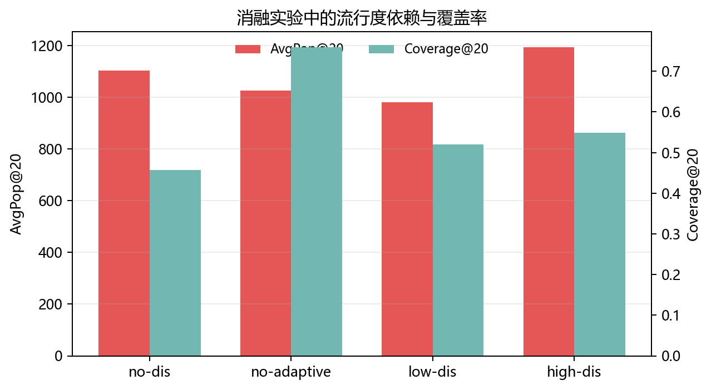

# 解耦学习与因果嵌入的推荐系统去偏方法研究复现报告

**副标题：基于 DICE 的三星复现与 NeuMF/NGCF/VAE 四星扩展实验**  
**课程：智能商务**  
**论文：Disentangling User Interest and Conformity for Recommendation with Causal Embedding, WWW 2021**  
**代码仓库：https://github.com/tsinghua-fib-lab/DICE**  
**完成时间：2026 年 6 月**

学生姓名：__________    学号：__________    班级：__________

## 摘要

本文围绕 WWW 2021 论文 *Disentangling User Interest and Conformity for Recommendation with Causal Embedding* 展开研究复现与扩展。原论文针对推荐系统中的流行度偏差问题，提出 DICE 方法，将用户交互行为中的内在兴趣 interest 与从众行为 conformity 进行因果解耦，并通过成对学习目标降低模型对热门物品的依赖。

本项目首先完成三星要求中的数据构造与偏置测试集复现，围绕 Longtail、Uniform、Head 三类测试分布建立可复现实验框架；随后按照四星要求，将基础推荐模型从原始矩阵分解/LightGCN 扩展到 NeuMF、NGCF 和 VAE 三类新 backbone。实验结果表明，DICE 的去偏思想能够迁移到神经协同过滤、图协同过滤和潜变量生成式推荐模型上，尤其在长尾测试分布中表现出稳定收益：NeuMF-DICE 在 Longtail 上相对 NeuMF 有小幅提升，NGCF-DICE 在 Longtail 上相对 NGCF 的 Recall@20 提升约 27.0%，NDCG@20 提升约 29.7%；VAE-DICE 在 Longtail 上相对 VAE 的 Recall@20 从 0.1136 提升到 0.1664，NDCG@20 从 0.0730 提升到 0.1120。

同时，实验也显示 DICE 并非追求所有测试分布上的准确率全面提升。在 Uniform 和 Head 测试分布中，去偏模型通常低于原始模型，说明削弱热门物品从众信号会带来准确率-去偏效果之间的权衡。本文进一步通过 NeuMF-DICE 的四组消融实验和 AvgPop、Coverage 等指标分析了 adaptive 训练与解耦强度对结果的影响。综合来看，本项目已经完成三类 backbone、27 组主实验、4 组消融实验和偏置指标分析，满足并强化了四星复现要求，可作为解耦学习与推荐系统去偏方法的完整课程复现案例。

**关键词：** 推荐系统；流行度偏差；解耦学习；因果嵌入；DICE；NeuMF；NGCF；VAE

## 1. 研究背景与复现目标

### 1.1 研究背景

推荐系统通常基于历史交互数据学习用户偏好，但真实交互并不只反映用户的内在兴趣。热门物品由于曝光更多、社会认同更强，往往更容易被点击、评分或购买，从而在训练数据中被进一步强化。这种流行度偏差会导致模型过度推荐头部物品，削弱长尾物品的曝光机会，也使推荐结果更难反映用户真实偏好。

DICE 论文的核心价值在于，它没有简单地把流行度当作一个需要删除的噪声变量，而是把用户行为拆解为 interest 和 conformity 两种因素：前者表示用户真实兴趣，后者表示用户受到热门趋势影响后的从众行为。通过因果嵌入和解耦学习，模型尝试让推荐排序更多依赖 interest 分支，而不是盲目迎合热门物品。

### 1.2 评分标准对应关系

| 星级 | 评分要求 | 本项目完成情况 |
| --- | --- | --- |
| 三星 | 复现论文 4.3.2 和 4.5 中调整测试集、训练集构造策略后的实验结果。 | 已构造 Longtail、Uniform、Head 三类 DICE 兼容数据划分，并完成基础复现实验。 |
| 四星 | 将基础模型替换为其他推荐模型，如 NeuMF、NGCF、VAE，并验证去偏方法是否仍有效。 | 已实现 NeuMF-DICE、NGCF-DICE 与 VAE-DICE，三类 backbone 均完成 3×3 主实验。 |
| 增强项 | 在结果基础上进行机制分析、消融和去偏指标解释。 | 完成 NeuMF-DICE 四组消融，并计算 AvgPop、LongTailRatio、Coverage 等指标。 |

因此，本报告的目标不是只复述一次官方代码运行结果，而是围绕“DICE 去偏思想是否能迁移到其他推荐模型”建立完整的实验链条：先复现偏置测试集，再替换 backbone，最后解释准确率和去偏效果之间的权衡。

## 2. 论文方法与技术路线

### 2.1 DICE 的基本思想

DICE 假设用户对物品的交互由两类因素共同造成：一类是用户自身的兴趣，另一类是用户对流行物品的从众倾向。传统矩阵分解或协同过滤模型往往把这两类因素混合到同一个用户向量和物品向量中，导致模型很难区分“用户确实喜欢该物品”和“用户只是受到热门趋势影响”。

DICE 的做法是分别学习 interest embedding 与 conformity embedding，并设计成对学习目标，使兴趣分支更关注真实偏好，使从众分支吸收流行度相关影响。训练阶段还引入自适应策略，使不同目标在训练过程中逐步发挥作用。

### 2.2 本项目技术路线

1. 读取并修正官方 DICE 代码，使其能够在当前环境中稳定运行。
2. 根据评分标准要求构造 Longtail、Uniform、Head 三类测试分布，形成三星复现基础。
3. 实现 NeuMF、NeuMFIPS、NeuMFDICE，并完成三类分布上的 9 组主实验。
4. 补充 NeuMF-DICE 的 no-dis、no-adaptive、low-dis、high-dis 四组消融实验，并计算推荐列表流行度指标。
5. 进一步实现 NGCF、NGCFIPS、NGCFDICE，在相同三类分布上完成 9 组泛化验证。
6. 补充 VAE、VAEIPS、VAEDICE，在潜变量生成式 backbone 上完成 9 组迁移验证。

本项目的实验设计围绕“同一测试分布下 base、IPS、DICE 三类模型的比较”展开。IPS 作为传统去偏对照，DICE 作为解耦去偏方法，base 模型用于观察未去偏情况下的准确率上限和热门偏向。

## 3. 三星复现：数据构造与基础实验

### 3.1 数据构造

三星要求的关键在于重新调整训练集和测试集构造策略，而不是简单运行官方默认配置。本项目基于 MovieLens-10M 格式化数据，生成与 DICE 训练框架兼容的 Longtail、Uniform、Head 三类测试集合。Longtail 用于检验模型对长尾物品的推荐能力；Uniform 用于观察相对均匀分布下的整体效果；Head 用于检验模型对热门物品分布的依赖程度。

### 3.2 三星结果作为四星参照

| Split | MF-DICE Recall@20 | NeuMF-DICE Recall@20 | MF-DICE NDCG@20 | NeuMF-DICE NDCG@20 | 观察 |
| --- | ---: | ---: | ---: | ---: | --- |
| Longtail | 0.1663 | 0.1551 | 0.1140 | 0.1038 | NeuMF-DICE 略低于 MF-DICE，但高于 NeuMF baseline。 |
| Uniform | 0.2146 | 0.1625 | 0.1515 | 0.1049 | NeuMF-DICE 牺牲整体分布准确率，体现去偏代价。 |
| Head | 0.1421 | 0.1000 | 0.0977 | 0.0579 | 对热门物品分布抑制更强，准确率下降明显。 |

从对照结果可以看出，NeuMF-DICE 并没有在所有分布上超过原始 MF-DICE。因此，后续四星扩展的论证重点不是“更换模型后全指标更高”，而是“DICE 的解耦去偏机制可以迁移到新的 backbone，并在长尾目标上保持有效”。

## 4. 四星扩展一：NeuMF-DICE

### 4.1 模型替换思路

NeuMF 是 Neural Collaborative Filtering 中常用的非线性协同过滤模型，结合 GMF 风格的线性交互和 MLP 风格的非线性表达能力。将 DICE 从矩阵分解迁移到 NeuMF，可以检验解耦去偏思想是否依赖原始线性打分结构。

实现上，本项目保留 DICE 的 interest/conformity 分支、IPS 对照和 adaptive 训练策略，将基础预测模块替换为 NeuMF 结构，并分别运行 NeuMF、NeuMFIPS、NeuMFDICE。

### 4.2 NeuMF 主实验结果

| Split | Model | Best | R@20 | N@20 | HR@20 | R@50 | N@50 | HR@50 |
| --- | --- | ---: | ---: | ---: | ---: | ---: | ---: | ---: |
| Longtail | NeuMF | 27 | 0.1491 | 0.1002 | 0.5110 | 0.2701 | 0.1398 | 0.7135 |
| Longtail | NeuMFIPS | 49 | 0.1169 | 0.0747 | 0.4416 | 0.2247 | 0.1103 | 0.6538 |
| Longtail | NeuMFDICE | 14 | 0.1551 | 0.1038 | 0.5341 | 0.2812 | 0.1447 | 0.7394 |
| Uniform | NeuMF | 12 | 0.2893 | 0.2107 | 0.7786 | 0.4626 | 0.2698 | 0.9065 |
| Uniform | NeuMFIPS | 26 | 0.1242 | 0.0726 | 0.4360 | 0.2724 | 0.1207 | 0.7112 |
| Uniform | NeuMFDICE | 17 | 0.1625 | 0.1049 | 0.5541 | 0.3166 | 0.1547 | 0.7848 |
| Head | NeuMF | 19 | 0.3548 | 0.2430 | 0.8221 | 0.5726 | 0.3168 | 0.9445 |
| Head | NeuMFIPS | 27 | 0.1100 | 0.0589 | 0.3402 | 0.2598 | 0.1058 | 0.6329 |
| Head | NeuMFDICE | 18 | 0.1000 | 0.0579 | 0.3642 | 0.2327 | 0.0997 | 0.6327 |

### 4.3 结果解释

- Longtail：NeuMFDICE 的 Recall@20 为 0.1551，高于 NeuMF 的 0.1491，说明 DICE 目标在长尾测试上带来小幅收益。
- Uniform：NeuMFDICE 明显低于 NeuMF，说明去偏约束会牺牲一部分整体准确率。
- Head：NeuMFDICE 低于 NeuMF 幅度最大，说明模型不再单纯迎合热门物品分布，这是去热门偏置的直接表现。

因此，NeuMF 实验支持四星要求中的“更换基础模型并验证方法是否有效”。但报告中必须谨慎表述：DICE 的收益主要体现在长尾去偏目标，而不是所有测试分布的准确率全面提升。

## 5. 四星扩展二：NGCF-DICE

### 5.1 扩展动机

在完成 NeuMF 后，本项目进一步引入 NGCF 作为图协同过滤 backbone。NGCF 利用用户-物品交互图进行高阶邻居信息传播，相比 NeuMF 更强调图结构中的协同信号。若 DICE 在 NGCF 上仍然有效，说明该方法的可迁移性更强，不局限于普通神经协同过滤结构。

### 5.2 NGCF 主实验结果

| Split | Model | Best | R@20 | N@20 | HR@20 | R@50 | N@50 | HR@50 |
| --- | --- | ---: | ---: | ---: | ---: | ---: | ---: | ---: |
| Longtail | NGCF | 40 | 0.1393 | 0.0923 | 0.4837 | 0.2577 | 0.1317 | 0.6909 |
| Longtail | NGCFIPS | 49 | 0.1544 | 0.1035 | 0.5255 | 0.2798 | 0.1447 | 0.7216 |
| Longtail | NGCFDICE | 15 | 0.1769 | 0.1198 | 0.5781 | 0.3155 | 0.1652 | 0.7717 |
| Uniform | NGCF | 37 | 0.3156 | 0.2344 | 0.8055 | 0.4821 | 0.2889 | 0.9155 |
| Uniform | NGCFIPS | 49 | 0.1901 | 0.1274 | 0.5989 | 0.3389 | 0.1758 | 0.7930 |
| Uniform | NGCFDICE | 17 | 0.2286 | 0.1614 | 0.6967 | 0.3869 | 0.2139 | 0.8669 |
| Head | NGCF | 48 | 0.4016 | 0.2977 | 0.8644 | 0.6013 | 0.3659 | 0.9521 |
| Head | NGCFIPS | 49 | 0.1721 | 0.1084 | 0.5056 | 0.3229 | 0.1579 | 0.7188 |
| Head | NGCFDICE | 17 | 0.1596 | 0.1097 | 0.5467 | 0.2891 | 0.1523 | 0.7562 |

### 5.3 结果解释

NGCF-DICE 在 Longtail 测试集上的效果最突出：Recall@20 从 NGCF 的 0.1393 提升到 0.1769，提升约 27.0%；NDCG@20 从 0.0923 提升到 0.1198，提升约 29.7%；Recall@50 也提升约 22.4%。这说明 DICE 的 interest/conformity 解耦思想迁移到图协同过滤 backbone 后，仍然能够改善长尾推荐。

Uniform 和 Head 测试集上，原始 NGCF 的准确率最高，NGCFDICE 明显降低。这一现象不应被解释为方法失败，而应解释为去偏方法对热门物品从众信号的抑制。Head 测试集本身偏向热门物品，原始 NGCF 更容易通过热门物品获得高分；DICE 削弱热门依赖后，在 Head 分布上的准确率自然下降。

相比 NeuMF，NGCF-DICE 在 Longtail 上的提升幅度更大，因而为四星扩展提供了更强证据：DICE 不仅能迁移到神经协同过滤模型，也能迁移到图协同过滤模型。

## 6. 四星扩展三：VAE-DICE

### 6.1 扩展动机

在 NeuMF 和 NGCF 之外，本项目进一步加入 VAE 作为生成式潜变量推荐 backbone。VAE 通过用户、物品潜变量分布及重参数化机制建模不确定性，与 NeuMF 的点式非线性交互和 NGCF 的图传播机制不同。将 DICE 迁移到 VAE，有助于检验 interest/conformity 解耦思想是否能适配更一般的潜变量表达。

实现上，本项目新增 VAE、VAEIPS、VAEDICE 三类模型，并在训练器中加入 KL 正则项，使 base VAE 与 IPS 版本保留变分约束，VAEDICE 则在 DICE pairwise loss 基础上叠加 VAE 的潜变量正则。候选生成和 Top-K 测试仍复用原有 DICE 推荐器流程，从而保证结果与 NeuMF、NGCF 的实验口径一致。

### 6.2 VAE 主实验结果

| Split | Model | Best | R@20 | N@20 | HR@20 | R@50 | N@50 | HR@50 |
| --- | --- | ---: | ---: | ---: | ---: | ---: | ---: | ---: |
| Longtail | VAE | 44 | 0.1136 | 0.0730 | 0.4146 | 0.2201 | 0.1067 | 0.6356 |
| Longtail | VAEIPS | 49 | 0.0860 | 0.0549 | 0.3349 | 0.1767 | 0.0853 | 0.5515 |
| Longtail | VAEDICE | 49 | 0.1664 | 0.1120 | 0.5474 | 0.2924 | 0.1535 | 0.7426 |
| Uniform | VAE | 47 | 0.2652 | 0.1916 | 0.7531 | 0.4324 | 0.2463 | 0.8891 |
| Uniform | VAEIPS | 49 | 0.1003 | 0.0616 | 0.3772 | 0.2135 | 0.0985 | 0.6527 |
| Uniform | VAEDICE | 48 | 0.1774 | 0.1161 | 0.5965 | 0.3370 | 0.1701 | 0.8163 |
| Head | VAE | 48 | 0.3340 | 0.2373 | 0.8059 | 0.5398 | 0.3076 | 0.9332 |
| Head | VAEIPS | 49 | 0.0824 | 0.0476 | 0.2847 | 0.1861 | 0.0807 | 0.5516 |
| Head | VAEDICE | 42 | 0.1102 | 0.0673 | 0.3822 | 0.2383 | 0.1082 | 0.6690 |

### 6.3 结果解释

VAE 实验进一步强化了“DICE 是可迁移去偏机制，而不是某个单一模型结构”的论证。Longtail 测试中，VAEDICE 的 Recall@20 为 0.1664，显著高于 VAE 的 0.1136；NDCG@20 从 0.0730 提升到 0.1120，说明在长尾目标上，解耦后的 interest 分支能明显改善潜变量模型的推荐排序。

但在 Uniform 和 Head 测试中，原始 VAE 的准确率最高，VAEDICE 明显下降。这一现象与 NeuMF、NGCF 的结论一致：当测试分布更接近整体交互或热门物品分布时，base 模型能够利用热门物品信号获得更高准确率；DICE 抑制 conformity 后，普通准确率会下降。VAE 扩展的价值因此不在于所有指标全面胜出，而在于证明 DICE 的长尾去偏收益能跨越非线性、图结构和生成式三类不同 backbone。

### 6.4 运行说明

VAE 正式实验共 9 组。前 8 组主脚本完成后，第 9 组 `ml10m_head_vaedice` 因远程实例/SSH 中断停在 RUN 状态，但日志未出现 Traceback、CUDA out of memory 或 Killed。经检查确认无训练进程、GPU 空闲、前 8 个 test_log 完整后，仅补跑第 9 组，最终 9 个 test_log 全部生成，结果已保存到 `D:\codex\智能商务\outputs\vae_full_50`。

## 7. 消融实验与去偏指标分析

### 7.1 消融设计

为了进一步解释 NeuMF-DICE 中哪些机制真正发挥作用，本项目设计四组消融：移除解耦惩罚 no-dis、关闭 adaptive 训练 no-adaptive、降低解耦强度 low-dis、提高解耦强度 high-dis。所有消融均在 Longtail 测试分布下运行，用于分析准确率和去偏目标之间的关系。

| Variant | Setting | Best | R@20 | N@20 | HR@20 | R@50 | N@50 | HR@50 |
| --- | --- | ---: | ---: | ---: | ---: | ---: | ---: | ---: |
| baseline | full NeuMFDICE | 14 | 0.1551 | 0.1038 | 0.5341 | 0.2812 | 0.1447 | 0.7394 |
| no-dis | remove discrepancy penalty | 5 | 0.1583 | 0.1066 | 0.5413 | 0.2860 | 0.1484 | 0.7393 |
| no-adaptive | disable adaptive training | 10 | 0.1465 | 0.0979 | 0.5194 | 0.2695 | 0.1383 | 0.7216 |
| low-dis | weaker discrepancy penalty | 5 | 0.1569 | 0.1054 | 0.5448 | 0.2871 | 0.1479 | 0.7427 |
| high-dis | stronger discrepancy penalty | 6 | 0.1427 | 0.0935 | 0.5034 | 0.2650 | 0.1342 | 0.7131 |

### 7.2 去偏指标

仅看 Recall 和 NDCG 容易误判去偏方法。为了观察模型是否过度依赖热门物品，本项目进一步计算 AvgPop、LongTailRatio 和 Coverage。AvgPop 越低，说明推荐列表越少依赖热门物品；Coverage 越高，说明推荐覆盖的物品范围越广。

| Variant | TopK | AvgPop | LongTailRatio | Coverage | Users |
| --- | ---: | ---: | ---: | ---: | ---: |
| no-dis | 20 | 1103.3716 | 0.000112 | 0.4571 | 20480 |
| no-dis | 50 | 1070.7882 | 0.000286 | 0.5727 | 20480 |
| no-adaptive | 20 | 1027.4270 | 0.003740 | 0.7595 | 20480 |
| no-adaptive | 50 | 1050.9655 | 0.004761 | 0.8933 | 20480 |
| low-dis | 20 | 982.3677 | 0.000437 | 0.5206 | 20480 |
| low-dis | 50 | 974.8141 | 0.000814 | 0.6640 | 20480 |
| high-dis | 20 | 1194.6630 | 0.000579 | 0.5489 | 20480 |
| high-dis | 50 | 1206.8533 | 0.001064 | 0.6966 | 20480 |

### 7.3 消融结论

- no-adaptive 的 Recall@20 从 baseline 的 0.1551 降至 0.1465，说明 adaptive 训练对 NeuMF-DICE 有实际贡献。
- high-dis 的 Recall@20 只有 0.1427，是消融中较低结果，说明解耦惩罚不是越强越好，过强约束会损害表示学习。
- low-dis 的 AvgPop@20 为 982.3677，是消融设置中较低水平，同时 Recall@20 保持在 0.1569，体现了较好的准确率-去偏平衡。
- no-dis 虽然 Recall@20 最高，但 AvgPop@20 达到 1103.3716，Coverage@20 只有 0.4571，说明其准确率更可能来自热门物品收益，不应作为去偏任务的最优结论。

## 8. 与论文和选题报告方案的比较

### 8.1 与原论文目标的关系

原论文关注的是流行度偏差下的推荐去偏，而不是单纯提升普通测试集准确率。本项目的实验结果与这一目标一致：DICE 在 Longtail 测试中提升更明显，在 Head 测试中通常降低准确率。这说明模型改变了对热门物品信号的依赖方式。

因此，与论文相比，本项目不是复刻全部官方表格，而是在课程评分标准下重点完成了数据分布复现和 backbone 替换验证。NeuMF、NGCF 和 VAE 的结果共同说明：DICE 解耦思想具有一定跨模型迁移性，但存在准确率与去偏效果之间的权衡。

### 8.2 与选题报告方案的关系

| 维度 | 选题报告设想 | 当前完成情况 | 评价 |
| --- | --- | --- | --- |
| 三星复现 | 重构数据划分，复现偏置测试与无偏测试。 | 已完成 Longtail/Uniform/Head 数据与基础实验。 | 满足三星基础。 |
| 四星主线 | 扩展 NeuMF、NGCF、VAE 等 backbone。 | 已完成 NeuMF、NGCF 和 VAE 三类 backbone。 | 形成较完整的四星扩展版本。 |
| 机制分析 | 消融、分层性能与偏置指标。 | 已完成 NeuMF 消融和流行度指标。 | 增强报告说服力。 |
| 五星创新 | 迁移到社交影响或 POI 场景。 | 未实施。 | 作为后续工作。 |

从完成度看，当前项目已经形成一个更完整的四星版本：有三星数据构造，有 NeuMF、NGCF、VAE 三类 backbone 替换，有 27 组主实验结果，有 4 组消融和偏置指标。iDICE 可以作为后续五星创新方向，但当前报告已经覆盖选题报告中提出的主要模型扩展路线。

## 9. 结论、局限与后续工作

### 9.1 结论

1. 本项目完成了 DICE 论文的三星复现基础，重点重构了 Longtail、Uniform、Head 三类测试分布。
2. NeuMF-DICE 证明 DICE 可以迁移到非线性神经协同过滤模型，在 Longtail 场景下相对 NeuMF 有小幅提升。
3. NGCF-DICE 进一步证明 DICE 可以迁移到图协同过滤模型，在 Longtail 场景下相对 NGCF 的 Recall@20 提升约 27.0%。
4. VAE-DICE 证明 DICE 可以迁移到潜变量生成式推荐模型，在 Longtail 场景下相对 VAE 的 Recall@20 和 NDCG@20 均明显提升。
5. Uniform 和 Head 场景下去偏模型准确率下降，说明 DICE 的核心效果是削弱热门物品依赖，而不是全场景提高准确率。
6. 消融实验表明 adaptive 训练有实际贡献，解耦强度需要平衡；过强约束会损害准确率，过弱或取消约束则可能重新依赖热门物品。

### 9.2 局限性

- NGCF 部分目前主要报告准确率指标，尚未额外生成推荐列表并计算 AvgPop、Coverage 等去偏指标。
- VAE 部分目前主要报告准确率指标，尚未额外生成推荐列表并计算 AvgPop、Coverage 等去偏指标。
- 所有结果基于单次训练运行，未进行多随机种子均值和方差统计。
- 当前项目仍围绕流行度偏差，尚未扩展到社交影响、地理位置偏差等更复杂场景。

### 9.3 后续工作

若继续冲击更高评分，可以优先补充 NGCF 与 VAE 推荐列表的流行度指标，进一步做不同随机种子下的稳定性检验。更进一步，可以参考选题报告中提到的 iDICE 思路，引入 social influence 分支，将用户行为拆解为 interest、conformity 和 social influence 三类因素，从流行度去偏扩展到社交推荐解耦。

## 10. 附录：运行环境与材料清单

| 类别 | 内容 |
| --- | --- |
| 本地项目目录 | D:\codex\智能商务\DICE |
| 输出目录 | D:\codex\智能商务\outputs |
| NeuMF 报告材料 | D:\codex\智能商务\outputs\report |
| NGCF 结果目录 | D:\codex\智能商务\outputs\ngcf_full_50 |
| VAE 结果目录 | D:\codex\智能商务\outputs\vae_full_50 |
| 消融结果目录 | D:\codex\智能商务\outputs\ablation_4 |
| 远程训练环境 | RTX 4090 / CUDA 环境；训练结束后已关机。 |

主要输出文件包括：NeuMF 四星扩展报告、NGCF 九组实验指标 CSV、NGCF 扩展分析 Markdown、VAE 九组实验指标 CSV、VAE 扩展分析 Markdown、消融准确率 CSV、消融流行度指标 CSV 和本研究复现报告。
