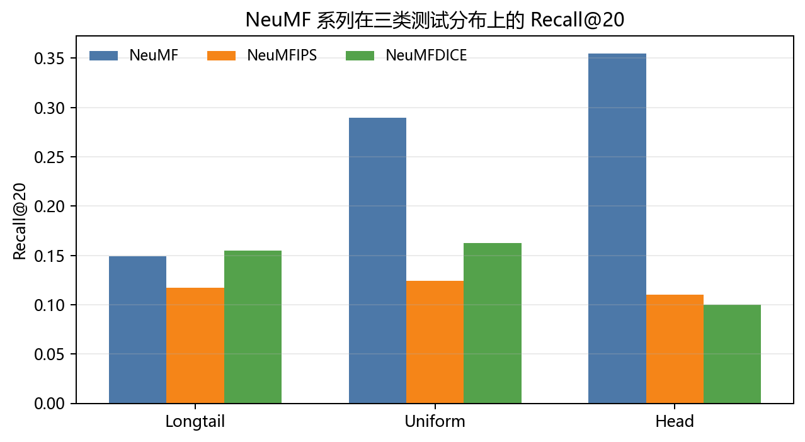
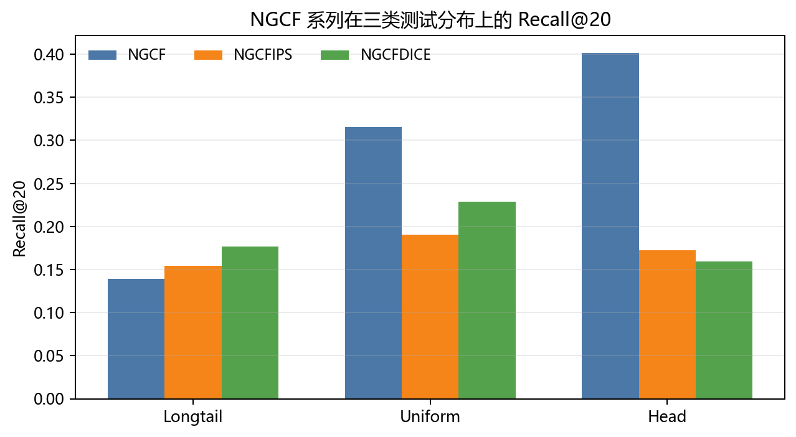
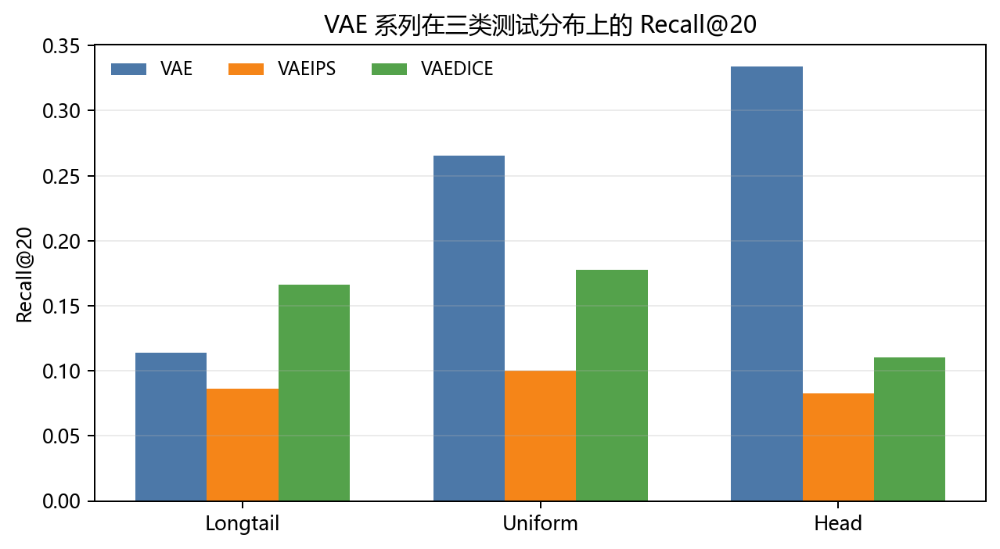
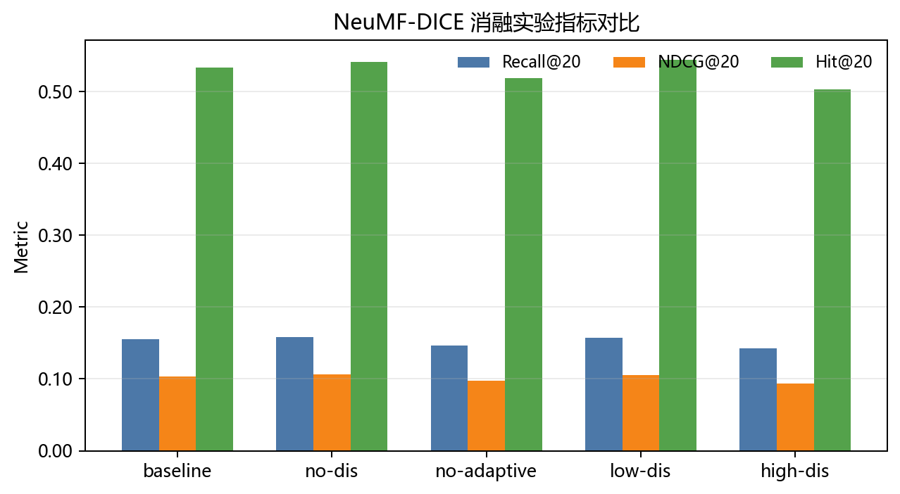
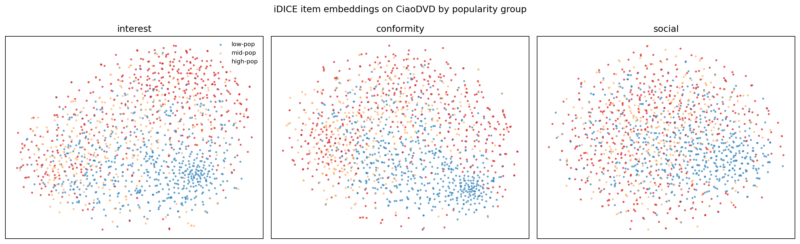

# 解耦学习与因果嵌入的推荐系统去偏方法研究复现报告

**副标题：从 DICE 三星复现到 NeuMF/NGCF/VAE 四星扩展与 iDICE 社交解耦五星创新**  
**课程：智能商务**  
**复现论文：Disentangling User Interest and Conformity for Recommendation with Causal Embedding, WWW 2021**  
**代码基础：Tsinghua FIB Lab DICE 官方框架**  
**完成时间：2026 年 6 月**

学生姓名：__________　学号：__________　班级：__________

## 摘要

本报告围绕 WWW 2021 论文 *Disentangling User Interest and Conformity for Recommendation with Causal Embedding* 展开研究复现与课程项目扩展。原论文提出 DICE 方法，将用户交互行为中的真实兴趣 interest 与从众行为 conformity 进行因果解耦，目标是在推荐系统中削弱热门物品带来的流行度偏差，使模型不只是迎合曝光更高、社会认同更强的头部物品。

本项目从三星复现开始，逐步扩展到四星和五星。三星阶段重构训练集与测试集，构造 Longtail、Uniform、Head 三类偏置测试分布，并在 DICE 兼容数据格式上完成基础复现。四星阶段将 DICE 的解耦去偏思想迁移到 NeuMF、NGCF 与 VAE 三类基础模型，形成神经协同过滤、图协同过滤、潜变量生成式推荐三个方向的对比实验。机制分析阶段补充四组消融实验，并使用 AvgPop、Coverage 等指标分析推荐列表的流行度偏差。五星阶段提出并实现课程级 iDICE 扩展，将 DICE 的二元解耦 interest + conformity 扩展为 interest + conformity + social influence 三元解耦框架，并在 CiaoDVD 与 Epinions 两个社交推荐数据集上完成跨数据集验证。

实验结果显示，DICE 的效果不应被理解为所有场景下提升普通准确率，而应理解为削弱热门依赖、改善长尾推荐、增强行为解释。四星实验中，NGCFDICE 在 Longtail 上相对 NGCF 的 Recall@20 从 0.1393 提升至 0.1769，提升约 27.0%；VAEDICE 在 Longtail 上相对 VAE 的 Recall@20 从 0.1136 提升至 0.1664。五星实验中，Epinions 数据集上 IDICE-high-social 相比 DICE 的 Recall@20 提升约 2.91%，Recall@50 提升约 3.36%，HitRatio@50 提升约 5.47%；CiaoDVD 上 IDICE-high-social 基本追平 MF 的 Recall，并在 HitRatio@50 上超过 MF。综合来看，本项目形成了从论文复现、模型迁移、机制分析到社交场景创新扩展的完整实验链条。

**关键词：** 推荐系统；流行度偏差；解耦学习；因果嵌入；DICE；NeuMF；NGCF；VAE；iDICE；社交推荐

## 1. 研究背景与复现目标

### 1.1 研究背景

推荐系统通常基于历史交互学习用户偏好，但真实交互并不只反映用户的内在兴趣。热门物品由于曝光更多、社会认同更强、被更多用户评价或购买，往往在训练数据中被进一步强化。模型如果直接拟合这些交互，就可能把“用户真正喜欢”与“用户只是受流行趋势影响”混在一起，从而过度推荐头部物品，削弱长尾物品的曝光机会。

DICE 论文的核心价值在于，它没有简单把流行度视为一个需要删除的噪声变量，而是把用户行为拆解为两种因素：interest 表示用户真实兴趣，conformity 表示用户受到热门趋势影响后的从众行为。通过分别学习两类 embedding，并在训练目标中加入解耦约束，模型试图让最终推荐更多依赖 interest，而不是盲目利用热门物品的从众信号。

### 1.2 评分标准与完成路径

| 星级 | 评分要求 | 本项目完成情况 |
|---|---|---|
| 三星 | 复现论文中调整测试集、训练集构造策略后的实验结果 | 构造 Longtail、Uniform、Head 三类 DICE 兼容数据划分，完成基础复现实验 |
| 四星 | 将基础模型替换为其他推荐模型，如 NeuMF、NGCF、VAE，并验证去偏方法是否仍有效 | 实现 NeuMF-DICE、NGCF-DICE、VAE-DICE，完成 27 组主实验 |
| 机制增强 | 对结果进行消融、偏置指标和推荐列表分析 | 完成 NeuMF-DICE 四组消融，计算 AvgPop、Coverage 等指标 |
| 五星 | 在选题报告基础上进行方法创新或应用拓展 | 提出 iDICE 三元解耦框架，引入 social influence 分支，并在 CiaoDVD 与 Epinions 双社交数据集验证 |

## 2. DICE 方法与项目技术路线

### 2.1 原论文方法概述

DICE 假设用户对物品的交互由 interest 与 conformity 共同产生。传统矩阵分解或协同过滤模型通常把两类因素压缩到同一个用户向量和物品向量中，导致模型难以区分“用户确实喜欢该物品”和“用户只是受到热门趋势影响”。DICE 将用户和物品 embedding 拆为兴趣分支与从众分支，并使用成对学习目标和解耦约束，使两类分支承担不同语义。

训练阶段，DICE 保留推荐任务的排序损失，同时引入区分热门/非热门物品的训练样本构造，使 conformity 分支吸收流行度相关信号，interest 分支更接近用户真实偏好。最终推荐时，模型更强调 interest 分支，从而在长尾推荐中获得收益。

### 2.2 本项目技术路线

1. 搭建 DICE 官方框架，修正环境、路径、依赖和候选生成问题，使其能在本地与远程 GPU 上稳定运行。
2. 根据评分标准构造 Longtail、Uniform、Head 三类测试分布，完成三星复现基础。
3. 实现 NeuMF、NeuMFIPS、NeuMFDICE，验证 DICE 能否迁移到非线性神经协同过滤。
4. 实现 NGCF、NGCFIPS、NGCFDICE，验证 DICE 能否迁移到图协同过滤。
5. 实现 VAE、VAEIPS、VAEDICE，验证 DICE 能否迁移到潜变量生成式推荐模型。
6. 设计四组 NeuMF-DICE 消融实验，分析 adaptive 训练和解耦强度对结果的影响。
7. 扩展 iDICE：在 interest 与 conformity 之外加入 social influence 分支，将 DICE 从流行度去偏扩展到社交推荐解耦。
8. 在 CiaoDVD 和 Epinions 两个社交数据集上训练 MF、DICE、IDICE-no-social、IDICE、IDICE-high-social，形成跨数据集验证。

### 2.3 统一训练与评估口径

为保证不同模型之间可以比较，本项目没有为每个 backbone 单独设计一套数据和指标，而是尽量复用 DICE 框架中的统一训练接口。基础 MF、NeuMF、NGCF、VAE 都使用 pairwise ranking 训练，即每个 batch 由用户、正样本物品和负样本物品组成，优化正样本得分高于负样本得分的 BPR 类目标。IPS 版本在 pairwise loss 外加入逆倾向权重，用于降低有偏训练样本对模型的影响。

DICE 版本的训练样本比普通 pairwise 样本多一个 `mask`。该 `mask` 来自 DICE sampler：对每个正样本物品，先根据物品流行度寻找比它更热门或更冷门的负样本；当负样本明显更热门时，样本更适合训练 conformity 分支识别从众信号；当负样本更冷门时，样本更适合训练 interest 分支学习真实偏好。模型最终同时计算 interest loss、popularity/conformity loss、total ranking loss 和 discrepancy loss。discrepancy loss 使用 L1、L2 或 distance correlation，本项目主实验使用 `dcor`，目的不是让两个分支相似，而是通过负号约束让两个分支尽量学习不同表示。

评估阶段统一使用 Recall、NDCG 和 HitRatio，主要报告 Top-20 与 Top-50。每个模型训练过程中先在验证集上选择 best epoch，再在测试集上输出最终指标。候选生成时，MF、DICE、NGCF 等可以直接导出 user/item embedding 用内积检索；NeuMF 和 VAE 的打分依赖前向网络，因此使用分块全量打分的 Top-K generator，避免一次性计算所有用户和物品导致显存或内存压力过大。

从目标函数看，普通 pairwise 模型优化的是 `L_rank = -log sigmoid(s(u,i+) - s(u,i-))`。DICE 类模型在此基础上把得分拆为 `s_int` 与 `s_pop` 两部分，整体目标可以概括为：`L = L_total + alpha * L_int + beta * L_pop - gamma * D(z_int, z_pop)`。其中 `L_total` 保证最终推荐排序有效，`L_int` 让 interest 分支学习真实偏好排序，`L_pop` 让 popularity/conformity 分支吸收热门从众信号，`D` 表示两个分支之间的差异度约束。本项目主实验使用 distance correlation 作为 `D`，因为它比简单 L2 距离更关注变量相关性，有助于降低两个分支表示之间的统计依赖。

### 2.4 关键参数与实验组织

为了减少不同模型之间的非必要差异，本项目尽量保持共同训练参数一致。基础 embedding size 设置为 64；优化器使用 Adam，学习率 `lr=0.001`，weight decay 为 `5e-8`；负采样比例 `neg_sample_rate=4`；验证和测试指标统一为 recall、hit_ratio、ndcg；Top-K 统一报告 `20` 和 `50`；模型选择使用验证集上的 recall 作为主要观察指标。DICE 及其扩展模型中，主实验使用 `dis_loss=dcor`、`dis_pen=0.01`、`int_weight=0.1`、`pop_weight=0.1`。

不同 backbone 的额外参数保持相对保守。NeuMF 的 MLP 层为 `[128, 64, 32]`，dropout 为 0；NGCF 使用 2 层图传播，dropout 为 0.2；VAE 的 latent size 为 64，hidden size 为 128，KL loss 权重为 0.001；iDICE 在 DICE 参数基础上加入 `social_weight` 和 `social_reg_weight`，并通过 no-social、low-social、high-social 三类设置比较社交分支强弱。实验组织上，每个 backbone 都至少包含 base、IPS、DICE 三个版本，使比较对象分别对应“不去偏”“倾向加权去偏”“解耦去偏”。

## 3. 数据来源、预处理与三星基础实验

### 3.1 数据来源与下载

本项目的数据来源分为两部分。三星与四星阶段使用 MovieLens-10M 派生数据，用于复现 DICE 论文中围绕流行度偏置构造训练集和测试集的实验逻辑；五星阶段使用 CiaoDVD 与 Epinions 两个带信任关系的数据集，用于验证 iDICE 在社交推荐场景下是否具有扩展价值。所有原始数据、预处理结果和输出文件均统一保存在 `D:\codex\智能商务` 下，避免占用 C 盘空间，也便于后续检查和提交。

MovieLens-10M 派生数据主要用于构造 Longtail、Uniform、Head 三类测试分布。CiaoDVD 使用 LibRec 提供的 `CiaoDVD.zip`，其中包含评分文件和 trust 关系文件。Epinions 使用 MSU/Jiliang Tang 发布的 timestamp 版本，原始文件保存在 `D:\codex\智能商务\datasets\epinions`，正式实验采用 `epinions_with_rating_timestamp_txt.zip`，解压后核心文件为 `rating_with_timestamp.txt` 和 `trust.txt`。

Epinions 的评分文件在正式处理前进行了字段确认。该文件共有 6 列，经过抽样和字段分布检查后确认：第 0 列为 user，第 1 列为 item，第 3 列为 1-5 分 rating，第 5 列为 timestamp。这个核验步骤很重要，因为如果误把第 4 列当作 rating，执行 `rating >= 4` 过滤后会得到空数据，导致后续训练无法进行。

具体处理时，MovieLens-10M 派生数据没有直接修改原始交互文件，而是以 DICE 已兼容的 `record.csv` 和稀疏矩阵为基础重新生成三类实验目录。CiaoDVD 和 Epinions 则从原始 rating/trust 文件开始处理：先解压原始压缩包，确认评分文件和 trust 文件都能被 pandas 正确读取；再检查列数、评分范围、时间戳是否为数值；最后才进入正反馈过滤和编号重映射。这样做的原因是推荐系统数据集常见问题不是模型代码错误，而是不同版本数据集的列含义不一致，如果不先核验字段，后续所有指标都会失去可信度。

### 3.2 数据预处理与划分

三星阶段的处理方法是先以 DICE 已兼容的 `record.csv` 为输入，保留 `uid`、`iid`、`ts` 三个字段并去重；然后统计每个物品在完整交互中的出现次数，得到物品流行度；接着按用户分组抽取测试样本，保证每个用户尽量保留可评估记录；再从剩余交互中按时间顺序划分验证集，并额外抽取 `train_skew` 模拟有偏训练样本。这一流程由 `DICE/tools/make_three_star_splits.py` 实现，最终输出 `record.csv`、`train_record.csv`、`train_skew_record.csv`、`val_record.csv`、`test_record.csv` 以及对应的稀疏矩阵 `.npz` 文件。其中 `train_skew` 用于模拟受流行度影响的偏置训练集，三类测试集用于观察模型在不同偏置环境下的表现。

Longtail 测试集提高长尾物品在测试集中的比例，用于观察模型是否能够摆脱热门物品依赖；Uniform 测试集构造相对均匀的测试分布，用于观察整体推荐效果；Head 测试集偏向头部热门物品，用于分析模型是否仍强依赖热门信号。后续 NeuMF、NGCF 和 VAE 都沿用同一套三类 split，保证不同 backbone 的结果可横向比较。

五星阶段的数据预处理方法是在 DICE 交互矩阵基础上额外构造社交关系矩阵。以 CiaoDVD 为例，`DICE/tools/prepare_ciao_social.py` 的具体处理顺序是：先读取评分表和 trust 表，并根据 LibRec CiaoDVD 的字段格式识别用户列、物品列、评分列和时间戳列；再按照 `rating >= min_rating` 将高评分记录转为正反馈；随后按用户交互次数和物品交互次数进行迭代过滤，直到剩余用户和物品都满足最低交互阈值；之后把原始用户 ID 和物品 ID 重新映射为从 0 开始的连续编号；最后根据重映射后的交互生成 DICE 所需的交互表、稀疏矩阵、用户-物品二部图，以及后续 iDICE 需要的社交边文件。

Epinions 的处理方法与 CiaoDVD 保持同一输出格式，但字段解析更严格。`DICE/tools/prepare_epinions_social.py` 先按 MSU timestamp 版本读取 `rating_with_timestamp.txt` 的 6 列数据，并明确选取第 0 列作为 user、第 1 列作为 item、第 3 列作为 rating、第 5 列作为 timestamp；再按 `rating >= 4` 过滤正反馈，删除交互过少的用户和物品，并进行连续编号 reindex；随后按训练集、skew 训练集、验证集和测试集的比例进行划分。对 `trust.txt`，处理方法是只保留两端用户都出现在过滤后评分数据中的信任边，去除重复边和自环，输出边列表 `social_edges.csv`；同时把这些信任边转成对称用户-用户邻接矩阵 `social_adj.npz`，供 iDICE 的 social influence 分支和后续社交案例分析使用。

Epinions 的主要预处理参数为：`min_rating=4`、`min_user_interactions=5`、`min_item_interactions=5`、`test_frac=0.2`、`val_frac=0.1`、`skew_frac=0.2`、`seed=2026`。最终得到 18172 个用户、22582 个物品、356145 条正反馈交互和 253470 条社交边，其中训练集 201867 条、skew 训练集 51617 条、验证集 31604 条、测试集 71057 条。CiaoDVD 处理后得到 1327 个用户、1376 个物品、17325 条正反馈交互和 2840 条社交边。

三星 split 的具体做法如下。首先从完整交互 `record.csv` 中统计每个物品出现次数，得到物品流行度数组。然后按用户分组抽取测试样本，而不是从全局随机抽样，这样可以保证每个用户尽量都有测试记录。Longtail 使用流行度倒数作为抽样权重，使低流行度物品更容易进入测试集；Head 使用流行度本身作为抽样权重，使热门物品更容易进入测试集；Uniform 对每条交互赋相同权重。为了避免极端权重导致抽样过度集中，脚本中还设置了 `cap_percentile=90.0` 的权重截断。

测试集抽出后，剩余交互先按用户和时间戳排序，再把每个用户尾部一部分交互划为验证集，模拟“用较早历史预测较晚行为”的时序口径。随后在训练候选集中再按物品流行度直接加权抽取 `train_skew`，模拟训练数据中更容易出现热门物品的偏置。最后从训练候选集中扣除 `train_skew` 得到常规 `train`。因此本项目中的数据并不是简单随机拆分，而是显式构造了“有偏训练 + 不同测试分布”的实验环境。

社交数据的处理比 MovieLens 多两步。第一步是将原始用户 ID 和物品 ID 重新映射为从 0 开始的连续编号，输出 `user_reindex.json` 和 `item_reindex.json`，这样评分矩阵、社交边和推荐结果都使用同一套编号。第二步是只保留两端都出现在过滤后评分用户集合中的 trust 边，去掉自环和重复边，生成 `social_edges.csv`；同时构造对称的 `social_adj.npz`，使后续模型既能读取边列表做正则，也能读取邻接矩阵做统计分析。这个处理保证了 iDICE 的社交分支不会引用到没有交互记录、无法训练 embedding 的用户。

预处理后的核心文件可以分为四类。第一类是明文交互表，例如 `record.csv`、`train_record.csv`、`train_skew_record.csv`、`val_record.csv`、`test_record.csv`，这些文件便于人工检查每个 split 的样本数量和用户/物品编号。第二类是训练矩阵，例如 `train_coo_record.npz`、`train_skew_coo_record.npz`、`val_coo_record.npz`、`test_coo_record.npz`，模型实际读取的是这些稀疏矩阵。第三类是图结构文件，例如 `train_coo_adj_graph.npz`、`train_skew_coo_adj_graph.npz`、`train_blend_coo_adj_graph.npz`，NGCF 这类图模型需要用它们构造用户-物品二部图。第四类是统计和映射文件，例如 `popularity.npy`、`popularity_blend.npy`、`user_reindex.json`、`item_reindex.json`，它们分别用于 DICE sampler、IPS 权重、结果解释和案例分析。

在三类测试分布中，Longtail、Uniform、Head 的区别只体现在抽样权重上，其他过滤、验证集划分、输出格式保持一致。这样设计的好处是：如果模型在 Longtail 上提升、在 Head 上下降，可以较明确地归因于测试分布和去偏目标的相互作用，而不是因为三个数据集由不同预处理流程产生。换言之，三类 split 是一个受控实验变量，而不是三个互不相干的数据集。

### 3.3 数据处理质量控制

为避免“数据能跑但含义错误”的问题，预处理阶段做了几类检查。首先检查评分列取值是否落在合理范围内，例如 Epinions 第 3 列应为 1-5 分评分；其次检查过滤后交互数是否非零，并统计用户数、物品数、训练/验证/测试样本数；再次检查 trust 边两端是否都能映射到过滤后的用户集合；最后检查稀疏矩阵形状是否与 `n_user`、`n_item` 一致。Epinions 初始字段判断错误时，正是因为过滤后样本异常为空，才定位到评分列选择问题。

数据处理完成后，还需要确认训练口径和评估口径不会发生信息泄漏。测试集先从完整交互中抽出，后续训练集和 skew 训练集都从剩余交互中构造；验证集按用户时间顺序从训练候选集中切出；模型训练只读取训练相关矩阵，测试时才读取 `test_coo_record.npz`。社交边虽然来自完整 trust 文件，但只用于用户之间的社交正则，不包含用户对测试物品的点击或评分标签，因此不会直接泄漏测试交互。

### 3.4 三星结果的作用

三星复现为后续四星扩展提供了统一实验口径。后续 NeuMF、NGCF 和 VAE 都在相同三类分布上比较 base、IPS、DICE 三类模型，使结果能够横向比较。项目结论也以此为基础：DICE 的价值主要体现在 Longtail 分布下改善长尾推荐，而不是在 Uniform 或 Head 场景中全面提高准确率。

## 4. 四星扩展一：NeuMF-DICE

### 4.1 扩展动机

NeuMF 是 Neural Collaborative Filtering 中常用的非线性协同过滤模型，结合 GMF 风格的线性交互和 MLP 风格的非线性表达。将 DICE 从矩阵分解迁移到 NeuMF，可以验证解耦去偏机制是否依赖原始线性打分结构。

具体实现时，普通 NeuMF 被拆成 GMF 和 MLP 两条路径。GMF 路径分别查找 user/item embedding 后做逐维乘积，MLP 路径分别查找 user/item embedding 后拼接，再经过 `[128, 64, 32]` 的多层感知机。最后将 GMF 输出与 MLP 输出拼接，通过线性层得到用户对物品的打分。NeuMFIPS 保持相同网络结构，只是在训练 loss 中加入 IPS 权重。

NeuMFDICE 的关键不是简单把 NeuMF 放进 DICE，而是建立两套独立 NeuMF：一套作为 interest 分支，一套作为 popularity/conformity 分支。训练时同一个用户、正样本和负样本会分别进入两套 NeuMF，得到 `p_score_int/n_score_int` 和 `p_score_pop/n_score_pop`。interest 分支按照正常偏好排序优化；popularity 分支根据 DICE sampler 产生的 mask 学习热门/非热门对比；最终总分为两个分支相加。同时，对两套 NeuMF 的用户和物品 embedding 加 discrepancy 约束，避免两个分支学成同一种表示。

NeuMF、NeuMFIPS、NeuMFDICE 三组实验的差异因此非常明确：NeuMF 只看交互排序；NeuMFIPS 仍然只有一套 NeuMF 表示，但用倾向权重修正样本贡献；NeuMFDICE 则把表示空间显式拆成两套分支。三者使用相同数据 split 和相同评估指标，所以结果差异主要反映去偏策略不同，而不是数据或指标变化。

### 4.2 NeuMF 主要结果

| Split | Model | Best | R@20 | N@20 | HR@20 | R@50 | N@50 | HR@50 |
|---|---|---:|---:|---:|---:|---:|---:|---:|
| Longtail | NeuMF | 27 | 0.1491 | 0.1002 | 0.5110 | 0.2701 | 0.1398 | 0.7135 |
| Longtail | NeuMFIPS | 49 | 0.1169 | 0.0747 | 0.4416 | 0.2247 | 0.1103 | 0.6538 |
| Longtail | NeuMFDICE | 14 | 0.1551 | 0.1038 | 0.5341 | 0.2812 | 0.1447 | 0.7394 |
| Uniform | NeuMF | 12 | 0.2893 | 0.2107 | 0.7786 | 0.4626 | 0.2698 | 0.9065 |
| Uniform | NeuMFIPS | 26 | 0.1242 | 0.0726 | 0.4360 | 0.2724 | 0.1207 | 0.7112 |
| Uniform | NeuMFDICE | 17 | 0.1625 | 0.1049 | 0.5541 | 0.3166 | 0.1547 | 0.7848 |
| Head | NeuMF | 19 | 0.3548 | 0.2430 | 0.8221 | 0.5726 | 0.3168 | 0.9445 |
| Head | NeuMFIPS | 27 | 0.1100 | 0.0589 | 0.3402 | 0.2598 | 0.1058 | 0.6329 |
| Head | NeuMFDICE | 18 | 0.1000 | 0.0579 | 0.3642 | 0.2327 | 0.0997 | 0.6327 |

### 4.3 结果解释

Longtail 场景中，NeuMFDICE 的 Recall@20 为 0.1551，高于 NeuMF 的 0.1491，说明 DICE 目标在长尾测试上带来小幅收益。Uniform 与 Head 场景中，NeuMFDICE 明显低于 NeuMF，这说明去偏约束会牺牲一部分整体准确率，尤其会降低对热门物品分布的拟合能力。该结果符合 DICE 的方法目标：削弱热门从众信号，而不是在所有分布下追求最高准确率。

## 5. 四星扩展二：NGCF-DICE

### 5.1 扩展动机

NGCF 利用用户-物品交互图进行高阶邻居信息传播，相比 NeuMF 更强调图结构中的协同信号。将 DICE 迁移到 NGCF，可以检验解耦去偏思想是否能适配图协同过滤 backbone。

NGCF 的输入不再只是用户 ID 和物品 ID，而是用户-物品二部图。预处理阶段生成 `train_blend_coo_adj_graph.npz`，其中节点由用户和物品拼接而成，边来自训练交互和 skew 训练交互的合并。模型读取该图后加入自环，并使用对称归一化得到稀疏邻接矩阵。每一层 NGCFConv 都在图上进行邻居传播，最后将多层表示拼接，形成包含高阶协同信息的用户和物品 embedding。

NGCFDICE 的实现方式是为 interest 和 popularity/conformity 分支分别建立一套图传播参数。也就是说，两个分支都在同一张用户-物品图上传播，但使用不同的初始 embedding 和不同的 NGCFConv 层。训练时先分别得到 `features_int` 和 `features_pop`，再计算两套分支的正负样本得分。loss 仍然沿用 DICE 的四部分结构：interest 排序、popularity/conformity 排序、总排序以及分支解耦约束。这样做可以判断 DICE 的收益究竟是否只能出现在 MF 这种浅层模型中，还是也能迁移到图传播表示中。

NGCF 系列的关键控制点在于图结构保持一致。NGCF、NGCFIPS、NGCFDICE 都读取同一份 `train_blend_coo_adj_graph.npz` 构造用户-物品图，因此三者看到的高阶邻居信息相同。区别仅在训练目标和参数结构：NGCF 是普通图协同过滤，NGCFIPS 对样本加权，NGCFDICE 采用双分支图传播和解耦约束。这样可以较清楚地回答“四星要求中的基础模型替换后，DICE 是否仍有效”。

### 5.2 NGCF 主要结果

| Split | NGCF R@20 | NGCFIPS R@20 | NGCFDICE R@20 | NGCFDICE N@20 | 结论 |
|---|---:|---:|---:|---:|---|
| Longtail | 0.1393 | 0.1544 | 0.1769 | 0.1198 | DICE 相比 NGCF R@20 提升约 27.0% |
| Uniform | 0.3156 | 0.1901 | 0.2286 | 0.1614 | 去偏后弱化热门分布收益 |
| Head | 0.4016 | 0.1721 | 0.1596 | 0.1097 | 热门测试中 base 占优 |

### 5.3 结果解释

NGCFDICE 在 Longtail 上表现最突出，Recall@20 从 NGCF 的 0.1393 提升到 0.1769，提升约 27.0%；NDCG@20 从 0.0923 提升到 0.1198，提升约 29.7%。这说明 DICE 的 interest/conformity 解耦思想迁移到图协同过滤后仍能改善长尾推荐。

Uniform 和 Head 上，原始 NGCF 的准确率最高，NGCFDICE 明显下降。这是去偏方法的典型代价：当测试分布本身偏向整体热门或头部物品时，base 模型更容易利用热门信号获得高分，而 DICE 削弱热门依赖后会损失这部分收益。

## 6. 四星扩展三：VAE-DICE

### 6.1 扩展动机

VAE 通过潜变量分布和重参数化机制建模推荐中的不确定性，与 NeuMF 的点式非线性交互和 NGCF 的图传播机制不同。将 DICE 迁移到 VAE，有助于验证 interest/conformity 解耦思想是否能适配更一般的潜变量表达。

本项目中的 VAE 以用户 embedding 作为 encoder 输入，经过隐藏层得到潜变量均值 `mu` 和方差 `logvar`，训练时使用重参数化技巧采样潜变量 `z`，测试时直接使用均值表示。物品侧使用 latent-size 维 embedding，用户潜变量与物品 embedding 做内积得到推荐分数。VAE 的训练目标除 pairwise ranking 外，还包含 KL loss，使潜变量分布不会无限偏离先验。

VAEDICE 使用两套 VAE 分别建模 interest 与 popularity/conformity。两个分支各自编码用户潜变量，分别计算正负样本得分，并共同组成总排序分数。与 NeuMFDICE 类似，VAEDICE 也加入分支间 discrepancy 约束；与其他 DICE 版本不同的是，它额外保留 `kl_weight * kl_loss`，避免潜变量模型在解耦训练中退化为普通 embedding 表。这个设计使 VAE-DICE 同时具备潜变量正则和 DICE 去偏约束。

VAE 系列的实验意义在于，它不是在原始 DICE 的矩阵分解结构上做小修小补，而是把解耦思想迁移到“用户潜变量分布”上。如果 VAEDICE 在 Longtail 上仍然提升，说明 interest/conformity 解耦不仅适用于确定性 embedding，也可以作用于带不确定性建模的推荐表示。实验结果中 VAEDICE 的 Longtail 提升较明显，因此它是四星扩展中较有说服力的一组。

### 6.2 VAE 主要结果

| Split | VAE R@20 | VAEIPS R@20 | VAEDICE R@20 | VAEDICE N@20 | 结论 |
|---|---:|---:|---:|---:|---|
| Longtail | 0.1136 | 0.0860 | 0.1664 | 0.1120 | VAEDICE 长尾提升最明显 |
| Uniform | 0.2652 | 0.1003 | 0.1774 | 0.1161 | 去偏牺牲普通分布准确率 |
| Head | 0.3340 | 0.0824 | 0.1102 | 0.0673 | 抑制热门依赖导致 Head 下降 |

### 6.3 结果解释

VAE 实验进一步强化了“DICE 是可迁移去偏机制”的论证。Longtail 测试中，VAEDICE 的 Recall@20 为 0.1664，显著高于 VAE 的 0.1136；NDCG@20 从 0.0730 提升到 0.1120。说明在长尾目标上，解耦后的 interest 分支能明显改善潜变量模型的推荐排序。

Uniform 与 Head 场景中，原始 VAE 准确率更高，VAEDICE 明显下降。这与 NeuMF、NGCF 的现象一致：DICE 的核心效果是削弱热门物品依赖，因此普通准确率与去偏效果之间存在权衡。

## 7. 消融实验与去偏指标分析

### 7.1 消融实验设计

为分析 NeuMF-DICE 中哪些机制真正发挥作用，本项目设计了四组消融：移除解耦惩罚 no-dis、关闭 adaptive 训练 no-adaptive、降低解耦强度 low-dis、提高解耦强度 high-dis。所有消融均在 Longtail 分布上运行。

四组消融的设计逻辑如下。`no-dis` 将分支间 discrepancy 约束去掉，用来判断模型是否只是因为多了一套参数而提升；如果 no-dis 准确率高但热门偏置指标变差，说明解耦约束对去偏仍有价值。`no-adaptive` 关闭训练过程中的权重衰减，用来判断动态调整 interest/popularity loss 权重是否必要。`low-dis` 和 `high-dis` 分别降低和提高解耦强度，用来观察约束过弱或过强时的变化。这样比只做一个“去掉模块”的消融更完整，可以看到解耦强度和训练策略之间的权衡。

| Variant | Setting | R@20 | N@20 | R@50 | N@50 | 观察 |
|---|---|---:|---:|---:|---:|---|
| baseline | full NeuMFDICE | 0.1551 | 0.1038 | 0.2812 | 0.1447 | 完整设置作为参照 |
| no-dis | remove discrepancy | 0.1583 | 0.1066 | 0.2860 | 0.1484 | 准确率略高但更可能依赖热门物品 |
| no-adaptive | disable adaptive | 0.1465 | 0.0979 | 0.2695 | 0.1383 | adaptive 有实际贡献 |
| low-dis | weaker discrepancy | 0.1569 | 0.1054 | 0.2871 | 0.1479 | 较好的准确率-去偏平衡 |
| high-dis | stronger discrepancy | 0.1427 | 0.0935 | 0.2650 | 0.1342 | 约束过强损害表达学习 |

### 7.2 去偏指标分析

只看 Recall 和 NDCG 容易误判去偏方法。为观察模型是否过度依赖热门物品，本项目进一步计算 AvgPop、LongTailRatio 和 Coverage。AvgPop 越低，说明推荐列表越少依赖热门物品；Coverage 越高，说明推荐覆盖的物品范围越广。

这些指标的计算方式是先对每个测试用户生成 Top-K 推荐列表，再回查训练集中每个被推荐物品的交互次数作为 popularity。AvgPop@K 是 Top-K 列表中物品流行度的平均值，值越低说明推荐列表越少依赖热门物品；Coverage@K 是所有用户 Top-K 列表覆盖到的不同物品数量占物品总数的比例，值越高说明模型不是反复推荐少数头部物品。它们不替代 Recall/NDCG，而是从另一个角度解释“去偏”是否真的发生。

消融结果显示：no-adaptive 的 Recall@20 从 baseline 的 0.1551 下降到 0.1465，说明 adaptive 训练有实际贡献；high-dis 的 Recall@20 只有 0.1427，说明解耦约束并非越强越好，过强会损害表达学习；low-dis 在保持较好准确率的同时降低热门依赖，是较平衡的设置。no-dis 虽然准确率略高，但 AvgPop 偏高、Coverage 较低，更可能重新依赖热门物品。

## 8. 五星创新：iDICE 三元社交因果解耦框架

### 8.1 从 DICE 到 iDICE

选题报告中提出的更高阶路径是将解耦学习从流行度去偏扩展到社交推荐场景。基于这一思路，本项目实现了 iDICE 课程级扩展。原始 DICE 将行为拆为 interest 与 conformity 两类因素；iDICE 进一步引入 social influence 分支，将用户行为拆解为三类因素：

1. interest：用户自身真实兴趣。
2. conformity：受到热门趋势影响的从众行为。
3. social influence：受到信任邻居、社交关系影响的行为。

实现上，iDICE 在模型中新增 social branch，并读取社交图 `social_edges.csv` 与 `social_adj.npz`。训练目标在原 DICE 排序损失和解耦约束基础上加入社交正则，使具有信任关系的用户在 social 分支中更接近。推荐打分时，将 social 分支按权重加入最终检索 embedding，并修正为与训练打分一致的权重缩放。

更具体地说，iDICE 在 DICE 原有 `users_int/items_int` 和 `users_pop/items_pop` 之外，新增 `users_social/items_social`。对于同一批训练样本，模型会同时计算三类得分：interest 得分、conformity 得分和 social 得分。总得分为 `interest + conformity + social_weight * social`。其中 `social_weight` 控制社交影响进入最终推荐排序的强度，`social_reg_weight` 控制信任邻居在 social embedding 空间中的接近程度。

社交正则的计算使用 `social_edges.csv` 中的 trust 边。每条边包含源用户 `src` 和目标用户 `dst`，训练时取两端用户的 social embedding，最小化它们的平方距离均值。这样并不是强行让信任邻居在所有兴趣上完全相同，而是只让 social 分支承担“社交影响相似性”，interest 和 conformity 分支仍然可以学习用户个人兴趣与热门从众信号。为了避免 social 分支和 interest 分支学成同一表示，iDICE 的 discrepancy loss 还加入了 interest-social 的差异约束。

推理时，iDICE 将 item embedding 拼接为 `items_int + items_pop + sqrt(social_weight) * items_social`，user embedding 也采用同样缩放。使用平方根缩放的原因是最终内积中用户侧和物品侧都会乘一次 social 分支，如果两侧都直接乘 `social_weight`，实际贡献会变成 `social_weight^2`，与训练时的线性权重不一致。修正后，检索阶段的 social 分支贡献与训练阶段的打分逻辑保持一致。

iDICE 的几个变体用于回答不同问题。`IDICE-no-social` 用来观察只增加 social 分支但不给社交信号时是否有效；如果它已经优于 DICE，说明模型容量或三分支结构本身可能带来收益。`IDICE` 使用默认社交权重，用来观察 trust 关系能否提供稳定增益。`IDICE-low-social` 和 `IDICE-high-social` 用来检查社交权重的敏感性：权重过低时 social 分支可能贡献不足，权重过高时可能把邻居影响放大过度。因此最终结论不是“social 越强越好”，而是需要在准确率、去偏和社交解释之间寻找平衡。

需要说明的是，iDICE 属于课程项目中的轻量级创新扩展，并不是完整复现 DiffNet++、DPS 或其他专门的社交推荐框架。它的价值在于沿着 DICE 的解耦思想加入 social influence 因素，并通过两个社交数据集验证该扩展是否有经验效果。严格的因果识别仍需要更强的干预设计、反事实评估或多随机种子显著性检验，这部分在本文中作为局限和后续工作处理。

### 8.2 数据集构造

CiaoDVD 与 Epinions 都包含评分数据和用户信任关系，适合验证社交影响分支。预处理过程包括：读取原始 rating/trust 文件、筛选正反馈评分、执行用户和物品 reindex、过滤没有足够交互的用户/物品、构造训练/验证/测试集、构造社交邻接矩阵。

| Dataset | Users | Items | Interactions | Social Edges | Train | Train-skew | Val | Test |
|---|---:|---:|---:|---:|---:|---:|---:|---:|
| CiaoDVD | 1327 | 1376 | 17325 | 2840 | 9548 | 2572 | 1787 | 3418 |
| Epinions | 18172 | 22582 | 356145 | 253470 | 201867 | 51617 | 31604 | 71057 |

CiaoDVD 更小，适合快速验证社交分支和可视化案例；Epinions 规模明显更大，适合作为第二数据集验证 iDICE 的泛化性。

## 9. iDICE 实验结果：CiaoDVD 与 Epinions

### 9.1 CiaoDVD 结果

| Model | Best | R@20 | N@20 | HR@20 | R@50 | N@50 | HR@50 |
|---|---:|---:|---:|---:|---:|---:|---:|
| MF | 48 | 0.1114 | 0.0596 | 0.2163 | 0.1919 | 0.0792 | 0.3316 |
| DICE | 49 | 0.0880 | 0.0476 | 0.1794 | 0.1632 | 0.0661 | 0.2954 |
| IDICE-no-social | 49 | 0.0995 | 0.0515 | 0.1929 | 0.1745 | 0.0698 | 0.3007 |
| IDICE | 48 | 0.0975 | 0.0541 | 0.1922 | 0.1695 | 0.0720 | 0.3044 |
| IDICE-low-social | 46 | 0.0959 | 0.0517 | 0.1801 | 0.1722 | 0.0703 | 0.2969 |
| IDICE-high-social | 45 | 0.1103 | 0.0557 | 0.2133 | 0.1916 | 0.0755 | 0.3369 |

CiaoDVD 上，MF 是很强的纯准确率基线。DICE 的 Recall@20 低于 MF，说明原始 DICE 在该社交小数据集上并不天然占优。但引入 iDICE 后，多个变体相对 DICE 有改善，其中 IDICE-high-social 的 R@20 为 0.1103，接近 MF 的 0.1114；HR@50 为 0.3369，超过 MF 的 0.3316。该结果说明 social influence 分支能够补充 DICE 在社交数据集上的信息来源。

CiaoDVD 的对照组设置包括三层含义。MF 用来表示不做解耦时的普通协同过滤基线；DICE 用来表示只做 interest/conformity 解耦、不使用社交关系时的表现；IDICE-no-social 保留 iDICE 的三分支结构但不强调社交信息，用来排除“只是参数更多”的解释；IDICE、IDICE-low-social、IDICE-high-social 则逐步改变社交分支权重，用来观察信任关系进入推荐排序后的影响。CiaoDVD 数据量较小，因此结果波动更明显，重点看 iDICE 是否能相对 DICE 恢复准确率并改善部分 HitRatio 指标。

### 9.2 Epinions 第二数据集结果

| Model | Best | R@20 | N@20 | HR@20 | R@50 | N@50 | HR@50 |
|---|---:|---:|---:|---:|---:|---:|---:|
| MF | 11 | 0.0166 | 0.0100 | 0.0593 | 0.0317 | 0.0143 | 0.1060 |
| DICE | 29 | 0.0283 | 0.0172 | 0.0903 | 0.0497 | 0.0231 | 0.1459 |
| IDICE-no-social | 29 | 0.0289 | 0.0180 | 0.0928 | 0.0513 | 0.0242 | 0.1524 |
| IDICE | 29 | 0.0280 | 0.0179 | 0.0926 | 0.0495 | 0.0238 | 0.1505 |
| IDICE-high-social | 29 | 0.0291 | 0.0178 | 0.0932 | 0.0514 | 0.0240 | 0.1539 |

Epinions 上，DICE 相比 MF 已有明显提升，说明在更大规模社交数据中，解耦去偏目标更容易发挥作用。IDICE-high-social 是综合最强设置：相比 DICE，R@20 从 0.0283 提升到 0.0291，提升约 2.91%；R@50 从 0.0497 提升到 0.0514，提升约 3.36%；HR@50 从 0.1459 提升到 0.1539，提升约 5.47%。相比 MF，IDICE-high-social 的 R@20 提升约 75.0%，R@50 提升约 62.0%。

Epinions 作为第二数据集的作用，是检验 iDICE 是否只在 CiaoDVD 这种小数据集上偶然有效。由于 Epinions 用户数、物品数、交互数和社交边数量都明显更大，训练时更能体现模型对稀疏社交信号的利用能力。实验保留 MF、DICE、IDICE-no-social、IDICE、IDICE-high-social 五组，是为了在训练成本可控的前提下覆盖三个关键比较：DICE 相对 MF 是否有效；iDICE 结构相对 DICE 是否有效；提高 social weight 是否能进一步利用 trust 信号。

### 9.3 跨数据集结论

CiaoDVD 与 Epinions 的结果并不完全相同。CiaoDVD 数据规模较小，MF 保持很强表现，iDICE 的优势主要体现在接近 MF 并提升 HR@50；Epinions 数据规模更大、社交边更多，DICE 和 iDICE 均明显优于 MF，且 high-social 设置取得最高 Recall 与 HitRatio。两组实验共同说明：社交影响分支不是简单堆参数，而是能在社交推荐数据中提供额外解释和增益。

## 10. 去偏、可视化与社交案例分析

### 10.1 推荐列表流行度指标

在 CiaoDVD 推荐列表分析中，MF 的 AvgPop@20 为 27.69，而 DICE、IDICE、IDICE-high-social 的 AvgPop@20 分别约为 19.41、19.30、19.31。这说明 iDICE 继承了 DICE 削弱热门依赖的特征，并没有因为加入社交分支而重新退化为热门物品推荐。

Coverage@50 也保持较高水平：IDICE 的 Coverage@50 为 0.9964，IDICE-high-social 为 0.9993，说明推荐列表覆盖了更广物品范围，有助于缓解头部集中。

### 10.2 三分支 embedding 可视化

可视化显示，interest、conformity 与 social 分支在 embedding 空间中形成不同结构。这并不能单独证明严格因果识别，但可以作为三分支学习到差异化表示的辅助证据。结合消融和跨数据集结果，说明 iDICE 的社交分支并非完全冗余。

### 10.3 社交案例分析

在用户级案例中，iDICE 的推荐列表与信任邻居历史物品有更高重叠。例如用户 801 有 10 个信任邻居，iDICE Top-20 中与邻居历史重叠 7 个物品，而 DICE 只有 2 个；用户 540 有 20 个信任邻居，iDICE 重叠 10 个，DICE 重叠 5 个。这说明 social influence 分支确实改变了推荐列表，使其更能反映社交邻居影响。

案例分析的生成过程是：先选择有足够 trust 邻居且测试集中存在可评估行为的用户，再汇总这些邻居在训练集中的历史交互物品，形成“邻居历史物品集合”；然后分别取 DICE 与 iDICE 的 Top-20 推荐列表，计算推荐列表与邻居历史集合的交集数量。这个指标不是最终准确率指标，但可以解释 iDICE 为什么在部分用户上改变排序：它把邻居行为作为 social 分支的额外信号，使推荐结果更接近社交影响路径。

## 11. 与原论文和选题报告的关系

### 11.1 与原论文的关系

本项目与原论文保持一致的核心是：推荐行为中存在从众和流行度偏差，解耦学习可以帮助模型降低热门依赖。不同之处在于，本项目没有完整复刻原论文全部官方数据集和所有表格，而是围绕课程评分标准完成数据分布复现、基础模型替换和创新扩展。

因此，本项目的贡献不是“复现出与论文完全相同的数值”，而是证明 DICE 的方法思想可以被迁移、分析和扩展：在 NeuMF、NGCF、VAE 三类 backbone 上，DICE 在 Longtail 场景表现出稳定长尾收益；在 iDICE 社交扩展中，social influence 分支在 CiaoDVD 和 Epinions 上带来额外信息。

从结果形态看，本项目与原论文的共同点是：DICE 类方法更适合被理解为“去偏和长尾改善方法”，而不是所有测试分布上的通用准确率增强器。原论文强调通过 interest/conformity 解耦削弱热门从众信号，本项目在 NGCFDICE、VAEDICE 的 Longtail 结果中观察到类似趋势。差异在于，本项目扩展了更多 backbone，并且引入了社交推荐场景；因此部分 Uniform 和 Head 指标下降不是复现失败，而是去偏目标与热门测试分布天然存在冲突。这个现象也解释了为什么报告同时使用 Recall/NDCG 和 AvgPop/Coverage：前者衡量命中效果，后者衡量推荐列表是否仍被热门物品主导。

### 11.2 与选题报告的关系

| 选题报告设想 | 实际完成情况 | 评价 |
|---|---|---|
| 复现 DICE 数据划分与偏置测试 | 已完成 Longtail/Uniform/Head 构造与实验 | 满足三星基础 |
| 替换基础推荐模型 | 已完成 NeuMF、NGCF、VAE 三类 backbone | 超出单一四星扩展 |
| 做消融和偏置指标分析 | 已完成四组消融、AvgPop、Coverage、推荐列表分析 | 增强机制解释 |
| 扩展到社交推荐 | 已实现 iDICE 三元解耦，并在 CiaoDVD/Epinions 验证 | 形成五星创新主线 |
| 更完整因果识别或 DPS 原框架 | 未完整接入 | 作为局限和后续工作 |

## 12. 结论、局限与后续工作

### 12.1 主要结论

1. 本项目完成了 DICE 三星复现基础，重点重构 Longtail、Uniform、Head 三类测试分布。
2. NeuMF-DICE 证明 DICE 可以迁移到非线性神经协同过滤，在 Longtail 上相对 NeuMF 有小幅提升。
3. NGCF-DICE 证明 DICE 可以迁移到图协同过滤，在 Longtail 上相对 NGCF 的 Recall@20 提升约 27.0%。
4. VAE-DICE 证明 DICE 可以迁移到潜变量生成式推荐，在 Longtail 上相对 VAE 的 Recall@20 从 0.1136 提升到 0.1664。
5. 消融实验表明 adaptive 训练与适中解耦强度有实际作用，过强解耦会损害表达能力，取消解耦可能重新依赖热门物品。
6. iDICE 将 DICE 从 interest + conformity 扩展为 interest + conformity + social influence，在 CiaoDVD 和 Epinions 两个社交数据集上形成跨数据集证据。
7. Epinions 第二数据集验证表明，IDICE-high-social 相比 DICE 在 R@20、R@50、HR@50 上均有提升，说明社交分支具备泛化价值。

### 12.2 局限性

- 未完整复现原论文所有官方数据集和全部表格，重点放在评分标准要求的数据构造与扩展验证。
- iDICE 是基于 DICE 框架的轻量社交扩展，没有完整接入 DiffNet++、CDRSB 或 DPS 等社交推荐原框架。
- 多数实验为单随机种子训练，未进行多种子均值、方差和显著性检验。
- 社交影响分支提供了经验有效性和案例解释，但严格因果识别仍需更强的反事实实验或干预设计。
- Epinions 数据规模较大但只运行 30 epoch，若继续调参或延长训练，指标可能进一步变化。

### 12.3 后续工作

后续可以从三个方向继续增强。第一，补充多随机种子实验和置信区间，使结果更具统计可靠性。第二，将 iDICE 与更成熟的社交推荐框架结合，例如图神经社交推荐或 trust-aware recommender，检验 social influence 分支在更复杂社交传播机制下的作用。第三，补充更严格的因果评估，例如基于干预的反事实推荐、社交边扰动鲁棒性实验、不同流行度分桶下的分层指标，从而更接近选题报告中“因果嵌入与应用拓展”的完整设想。

## 附录：运行环境与材料清单

| 类别 | 内容 |
|---|---|
| 本地项目目录 | D:\codex\智能商务\DICE |
| 输出目录 | D:\codex\智能商务\outputs |
| 四星报告目录 | D:\codex\智能商务\outputs\final_report |
| Ciao iDICE 结果 | D:\codex\智能商务\outputs\idice_ciao |
| Epinions iDICE 结果 | D:\codex\智能商务\outputs\idice_epinions |
| 跨数据集汇总 | D:\codex\智能商务\outputs\cross_dataset |
| NGCF 结果 | D:\codex\智能商务\outputs\ngcf_full_50 |
| VAE 结果 | D:\codex\智能商务\outputs\vae_full_50 |
| 消融结果 | D:\codex\智能商务\outputs\ablation_4 |
| 远程训练环境 | RTX 4090 / PyTorch 2.8 / CUDA 12.8 |

主要输出包括：NeuMF、NGCF、VAE 三类 backbone 实验结果，NeuMF-DICE 消融实验，CiaoDVD 与 Epinions 社交数据集 iDICE 实验结果，推荐流行度指标、t-SNE 可视化、社交案例分析和本最终研究复现报告。
