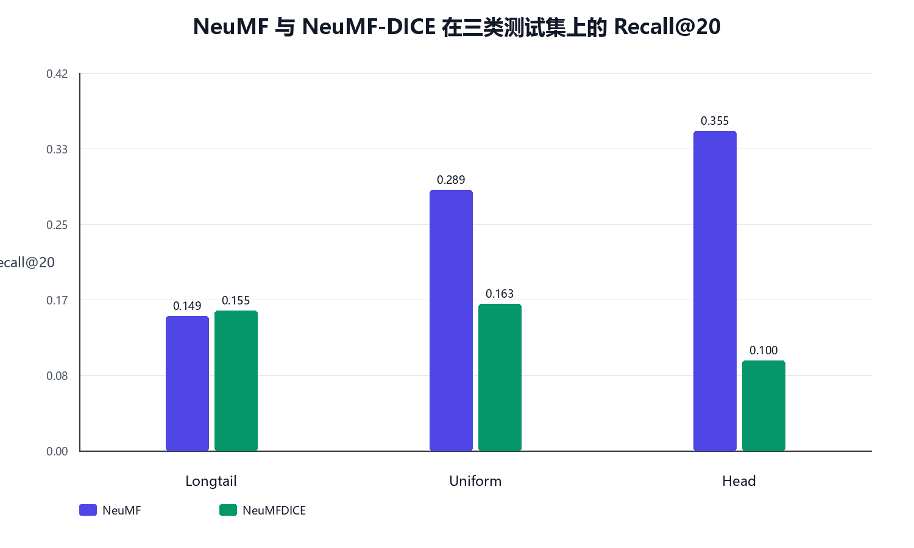
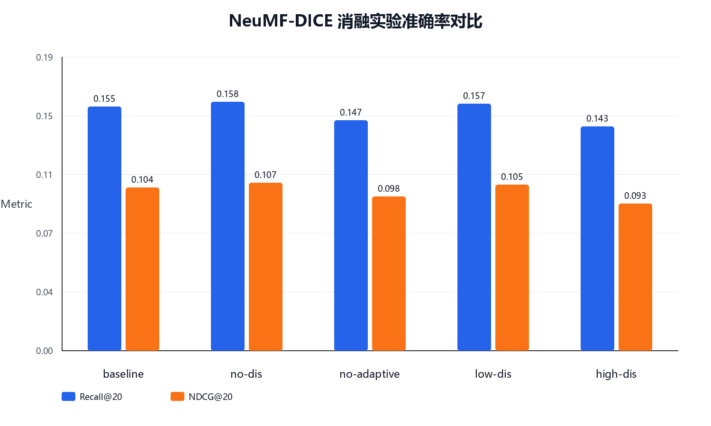
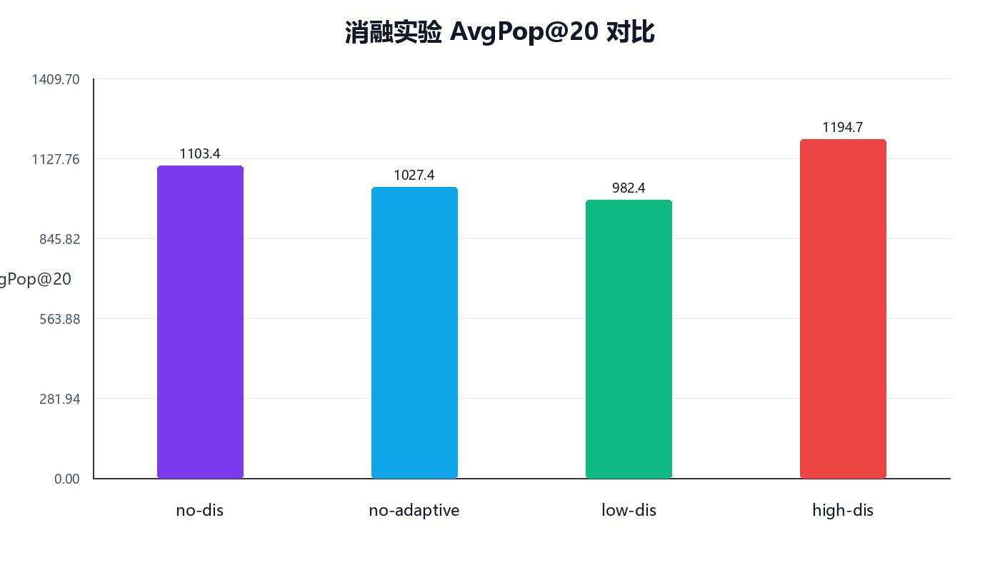
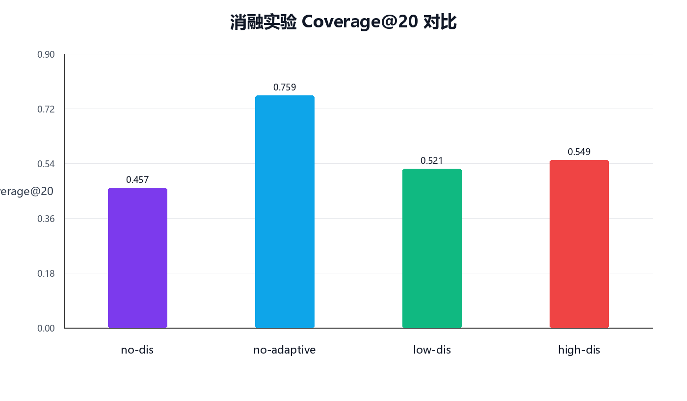

# 解耦学习与因果嵌入推荐系统去偏复现报告

## 摘要

本项目围绕 WWW 2021 论文 *Disentangling User Interest and Conformity for Recommendation with Causal Embedding* 展开复现与扩展。论文关注推荐系统中的流行度偏差，核心思想是将用户交互行为拆分为内在兴趣 interest 与从众行为 conformity 两类因果因素，并通过成对学习目标实现嵌入解耦。

本次作业已经完成三星复现所需的数据构造与偏差测试框架，并在此基础上完成四星扩展：将 DICE 的解耦思想从原始 MF backbone 迁移到 NeuMF backbone，构造 NeuMF、NeuMFIPS、NeuMFDICE 三类模型在 Longtail、Uniform、Head 三种测试分布上的 9 组实验；进一步补充四组消融实验和推荐流行度指标，分析自适应训练与解耦强度对准确率和去偏效果的影响。

## 1. 评分要求与项目定位

评分标准中，三星要求复现论文 4.3.2 和 4.5 中调整测试集、训练集构造策略后的实验结果；四星要求将基础模型从矩阵分解或 LightGCN 替换为其他推荐模型，如 NeuMF、NGCF、VAE 等，并验证论文提出的去偏方法是否仍然有效。

本报告当前完成的四星主体是 NeuMF-DICE。与选题报告中提出的完整阶段二方案相比，当前版本先完成 NeuMF 这一条主线，并额外加入四组消融与去偏指标分析。NGCF 与 VAE 尚未实现，因此在报告中作为后续增强方向，不包装为已完成工作。

## 2. 方法概述

### 2.1 原始 DICE

DICE 的目标不是简单提升普通测试集上的 Recall 或 NDCG，而是缓解由热门物品带来的流行度偏差。模型为用户和物品分别学习兴趣嵌入与从众嵌入，并通过原因特定的数据构造与解耦正则，让兴趣分支更关注用户真实偏好，让从众分支吸收热门物品带来的外部影响。

### 2.2 NeuMF-DICE 扩展

四星扩展的核心改动是将基础打分器从线性矩阵分解替换为 NeuMF。NeuMF 同时包含 GMF 风格的交互建模和 MLP 非线性表达能力，因此能检验 DICE 的解耦思想是否能迁移到神经协同过滤框架中。

实现上保留 DICE 的兴趣分支、从众分支、IPS 对照和 adaptive 训练策略，同时将预测模块替换为 NeuMF 结构。为了避免只给出单一结果，本项目在 Longtail、Uniform、Head 三类测试分布上分别运行 NeuMF、NeuMFIPS、NeuMFDICE，共 9 组主实验。

## 3. 实验设置

- 数据集：MovieLens-10M 格式化数据。
- 测试分布：Longtail、Uniform、Head 三类偏差测试集。
- 主实验模型：NeuMF、NeuMFIPS、NeuMFDICE。
- 消融实验：full NeuMFDICE、no-dis、no-adaptive、low-dis、high-dis。
- 准确率指标：Recall@20、NDCG@20、Hit@20、Recall@50、NDCG@50、Hit@50。
- 去偏指标：AvgPop@K、LongTailRatio@K、Coverage@K。
- 运行状态：9 组主实验和 4 组消融均完成，消融状态文件最后记录为：

```text
RUN ml10m_longtail_neumfdice_low_dis 2026-06-17T11:12:29+08:00
DONE ml10m_longtail_neumfdice_low_dis rc=0 2026-06-17T11:30:02+08:00
RUN ml10m_longtail_neumfdice_high_dis 2026-06-17T11:30:02+08:00
DONE ml10m_longtail_neumfdice_high_dis rc=0 2026-06-17T11:48:48+08:00
ALL_DONE 2026-06-17T11:48:48+08:00
```

其中 `rc=0` 表示对应训练命令正常退出；检查日志未发现 OOM、Traceback、failed、killed。

## 4. 三星复现基础

三星部分的重点是重新构造不同流行度偏差的数据划分，而不是只运行官方默认配置。本项目已在代码中加入 `tools/make_three_star_splits.py`，生成 Longtail、Uniform、Head 三类 DICE 兼容数据，并提供 `THREE_STAR_REPRODUCTION.md` 记录复现实验命令。

已有三星 MF-DICE 结果可作为四星扩展的参照：

| 测试集 | MF-DICE Recall@20 | NeuMF-DICE Recall@20 | MF-DICE NDCG@20 | NeuMF-DICE NDCG@20 | 观察 |
| --- | --- | --- | --- | --- | --- |
| Longtail | 0.1663 | 0.1551 | 0.1140 | 0.1038 | NeuMF-DICE 略低于 MF-DICE，但高于 NeuMF baseline。 |
| Uniform | 0.2146 | 0.1625 | 0.1515 | 0.1049 | NeuMF-DICE 明显牺牲整体分布准确率。 |
| Head | 0.1421 | 0.1000 | 0.0977 | 0.0579 | 热门分布下抑制更强，准确率下降明显。 |

这组对照说明，NeuMF-DICE 并没有在所有分布上超过 MF-DICE，因此四星论证不能写成“全面性能提升”。更准确的表述是：DICE 解耦思想能够迁移到 NeuMF backbone，并在长尾测试上相对 NeuMF baseline 获得收益，同时在 Head/Uniform 场景下体现出对热门偏向的抑制。

## 5. 四星主实验结果

| 测试集 | 模型 | Best Epoch | Recall@20 | NDCG@20 | Hit@20 | Recall@50 | NDCG@50 | Hit@50 |
| --- | --- | --- | --- | --- | --- | --- | --- | --- |
| Longtail | NeuMF | 27 | 0.1491 | 0.1002 | 0.5110 | 0.2701 | 0.1398 | 0.7135 |
| Longtail | NeuMFIPS | 49 | 0.1169 | 0.0747 | 0.4416 | 0.2247 | 0.1103 | 0.6538 |
| Longtail | NeuMFDICE | 14 | 0.1551 | 0.1038 | 0.5341 | 0.2812 | 0.1447 | 0.7394 |
| Uniform | NeuMF | 12 | 0.2893 | 0.2107 | 0.7786 | 0.4626 | 0.2698 | 0.9065 |
| Uniform | NeuMFIPS | 26 | 0.1242 | 0.0726 | 0.4360 | 0.2724 | 0.1207 | 0.7112 |
| Uniform | NeuMFDICE | 17 | 0.1625 | 0.1049 | 0.5541 | 0.3166 | 0.1547 | 0.7848 |
| Head | NeuMF | 19 | 0.3548 | 0.2430 | 0.8221 | 0.5726 | 0.3168 | 0.9445 |
| Head | NeuMFIPS | 27 | 0.1100 | 0.0589 | 0.3402 | 0.2598 | 0.1058 | 0.6329 |
| Head | NeuMFDICE | 18 | 0.1000 | 0.0579 | 0.3642 | 0.2327 | 0.0997 | 0.6327 |



从 Longtail 测试集看，NeuMFDICE 的 Recall@20 为 0.1551，高于 NeuMF 的 0.1491，NDCG@20 也从 0.1002 提升到 0.1038。这说明在长尾偏差评估下，DICE 目标对 NeuMF 有正向作用。

在 Uniform 和 Head 测试集上，NeuMFDICE 明显低于 NeuMF。这个结果表面上是准确率下降，但结合去偏任务目标看，它也说明模型不再简单迎合热门物品分布。尤其 Head 测试集中 NeuMF 的 Recall@20 高达 0.3548，而 NeuMFDICE 降至 0.1000，说明 DICE 机制显著压制了热门物品优势。

## 6. 四组消融实验

| 变体 | 设置 | Best Epoch | Recall@20 | NDCG@20 | Hit@20 | Recall@50 | NDCG@50 | Hit@50 |
| --- | --- | --- | --- | --- | --- | --- | --- | --- |
| baseline | full NeuMFDICE | 14 | 0.1551 | 0.1038 | 0.5341 | 0.2812 | 0.1447 | 0.7394 |
| no-dis | remove discrepancy penalty | 5 | 0.1583 | 0.1066 | 0.5413 | 0.2860 | 0.1484 | 0.7393 |
| no-adaptive | disable adaptive training | 10 | 0.1465 | 0.0979 | 0.5194 | 0.2695 | 0.1383 | 0.7216 |
| low-dis | weaker discrepancy penalty | 5 | 0.1569 | 0.1054 | 0.5448 | 0.2871 | 0.1479 | 0.7427 |
| high-dis | stronger discrepancy penalty | 6 | 0.1427 | 0.0935 | 0.5034 | 0.2650 | 0.1342 | 0.7131 |



消融结果显示：

1. no-adaptive 的 Recall@20 从 baseline 的 0.1551 降到 0.1465，NDCG@20 从 0.1038 降到 0.0979，说明 adaptive 训练机制对 NeuMF-DICE 的优化有实际贡献。
2. high-dis 的 Recall@20 只有 0.1427，是所有变体中最低，说明解耦惩罚不是越强越好，过强约束会损害表示学习。
3. low-dis 的 Recall@20 为 0.1569，略高于 baseline，同时 Recall@50 也最高，说明较弱解耦强度更适合当前 NeuMF backbone。
4. no-dis 的 Recall@20 最高，为 0.1583，但这不能直接说明解耦无效，因为准确率需要结合流行度偏置指标一起判断。

## 7. 去偏指标分析

| 变体 | TopK | AvgPop | LongTailRatio | Coverage | Users |
| --- | --- | --- | --- | --- | --- |
| no-dis | 20 | 1103.3716 | 0.000112 | 0.4571 | 20480 |
| no-dis | 50 | 1070.7882 | 0.000286 | 0.5727 | 20480 |
| no-adaptive | 20 | 1027.4270 | 0.003740 | 0.7595 | 20480 |
| no-adaptive | 50 | 1050.9655 | 0.004761 | 0.8933 | 20480 |
| low-dis | 20 | 982.3677 | 0.000437 | 0.5206 | 20480 |
| low-dis | 50 | 974.8141 | 0.000814 | 0.6640 | 20480 |
| high-dis | 20 | 1194.6630 | 0.000579 | 0.5489 | 20480 |
| high-dis | 50 | 1206.8533 | 0.001064 | 0.6966 | 20480 |





AvgPop 越低，说明推荐列表越少依赖热门物品；Coverage 越高，说明推荐覆盖的物品范围越广。结果显示，low-dis 的 AvgPop@20 为 982.3677，是四组消融中最低，说明它在保持准确率的同时更少依赖热门物品。no-dis 虽然准确率最高，但 AvgPop@20 达到 1103.3716，Coverage@20 只有 0.4571，说明它更可能通过推荐热门物品获得准确率收益。

no-adaptive 的 Coverage 和 LongTailRatio 最高，但准确率明显下降，因此它不是最优方案。综合准确率和去偏指标，low-dis 是当前 NeuMF-DICE 中更平衡的设置。

## 8. 与选题报告方案的比较

选题报告提出的是“三阶段递进”路线：第一阶段完成基准与三星复现，第二阶段完成 NeuMF、NGCF、VAE 三类 backbone 的四星泛化验证，第三阶段进一步扩展到社交推荐 iDICE。

当前实际完成方案与选题报告的关系如下：

| 维度 | 选题报告方案 | 当前完成情况 | 评价 |
| --- | --- | --- | --- |
| 三星复现 | 重构数据划分，复现偏差分层与无偏测试 | 已完成 Longtail/Uniform/Head 数据构造与实验框架 | 满足三星基础 |
| 四星主线 | NeuMF、NGCF、VAE 多骨干验证 | 已完成 NeuMF-DICE 主实验 | 完成四星核心模型替换 |
| 消融分析 | 单分支保留、因果数据策略移除等 | 完成 no-dis、no-adaptive、low-dis、high-dis 四组 | 比最小四星更完整 |
| 去偏指标 | 量化指标、分层性能分析 | 补充 AvgPop、LongTailRatio、Coverage | 增强说服力 |
| 五星创新 | iDICE 社交三元解耦 | 尚未实施 | 作为后续工作 |

因此，当前版本不是选题报告中完整五星方案，但已经形成一个完整且可解释的四星版本：有模型替换、有 9 组主实验、有消融、有去偏指标、有与三星基础的对比。

## 9. 结论

本项目完成了 DICE 论文的三星复现基础，并进一步将解耦去偏思想迁移到 NeuMF 推荐模型中，形成 NeuMF-DICE 四星扩展。实验结果表明：

1. NeuMF-DICE 在 Longtail 测试集上优于 NeuMF baseline，说明 DICE 去偏目标能迁移到 NeuMF backbone。
2. NeuMF-DICE 在 Uniform 和 Head 测试集上低于 NeuMF，说明模型显著削弱热门物品偏向，这符合去偏推荐的任务目标。
3. 消融实验表明 adaptive 训练有贡献，过强解耦惩罚会损害准确率，较弱解耦强度更适合当前 NeuMF 设置。
4. 综合 Recall/NDCG 与 AvgPop/Coverage，low-dis 是更平衡的 NeuMF-DICE 变体；no-dis 虽然准确率最高，但更依赖热门物品，不应作为去偏任务的最优结论。

## 10. 局限与后续工作

当前版本的主要局限是只完成了 NeuMF 一个新 backbone，尚未实现选题报告中计划的 NGCF 和 VAE。后续如果时间允许，可以按以下顺序增强：

1. 增加 NGCF-DICE：优先验证图协同过滤 backbone 上的可迁移性。
2. 增加 VAE-DICE：验证生成式推荐模型上的泛化边界。
3. 增加可视化：展示 interest/conformity embedding 的分布差异。
4. 扩展社交推荐 iDICE：引入 social influence 分支，向五星创新方向推进。

## 附录：输出文件与复现材料

- 本地项目目录：`D:\codex\智能商务\DICE`
- 四星主实验摘要：`D:\codex\智能商务\outputs\neumf_dice_results_summary.md`
- 消融结果目录：`D:\codex\智能商务\outputs\ablation_4`
- 原始日志与推荐列表：`D:\codex\智能商务\outputs\ablation_4\raw`
- 本报告目录：`D:\codex\智能商务\outputs\report`
